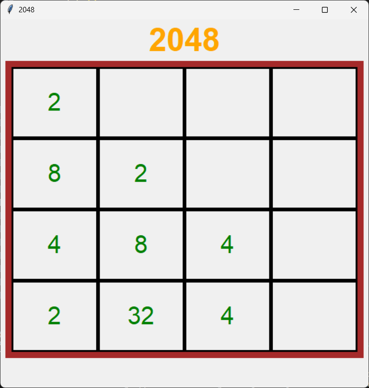

# 2048 Game
This repository contains my very old code, featuring two classic games implemented in Python:

- **`2048_gui.py`**: A graphical version using **Tkinter**.
- **`2048.py`**: A terminal version.
- **`tictac.py`**: tictactoe game using **Tkinter**.


## Screenshot

### GUI Version



## Installation
Ensure you have Python installed, then install the required dependencies using the following command:

```bash
pip install numpy tkinter
```

## How to Play

### GUI Version
- Fire it up like this:
  ```bash
  python 2048_gui.py
  ```
- Slam those Arrow Keys to slide tiles around like a boss.

### Terminal Version
- Kick it off with: 
  ```bash
  python 2048.py
  ```
- Use **W, A, S, D** to move the tiles **(W for Up, A for Left, S for Down, D for Right)**.

The whole deal? Get that sweet, sweet 2048 tile!